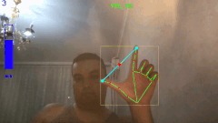
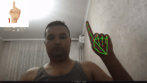
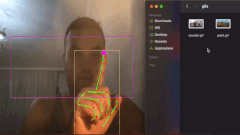
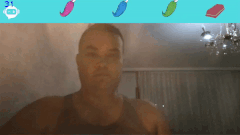

# Hand Tracking projects

Hand Tracking project using Google Mediapipe.

## Libraries used

- OpenCV
- Mediapipe by Google

## Projects implemented

- volume.py - Gesture Volume Control

  - 

- counter.py - Finger Counter

  - 

- mouse.py - Virtual On-screen Mouse

  - 

- paint.py - On-screen painter with finger  

  - 
